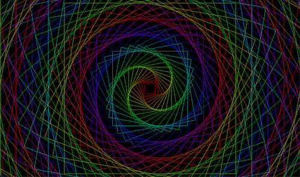

# graph-demos

Programmable graphics demos

### How to build

```bash
./gradlew dist
```

### How to run a demo

```bash
cd desktop/build/libs
java -XstartOnFirstThread -jar desktop-1.0.jar -d <demo name>

# for example:
java -XstartOnFirstThread -jar desktop-1.0.jar -d BoxSpiral

# -XstartOnFirstThread is needed for Mac OS
```

### Demos:

| Image                       | Comments                            |
|-----------------------------|-------------------------------------|
|  | Demo name: `BoxSpiral`<br/>Source: [BoxSpiral.java](https://github.com/kodlan/graph-demos/blob/readme/core/src/com/graphdemos/BoxSpiral.java) |

